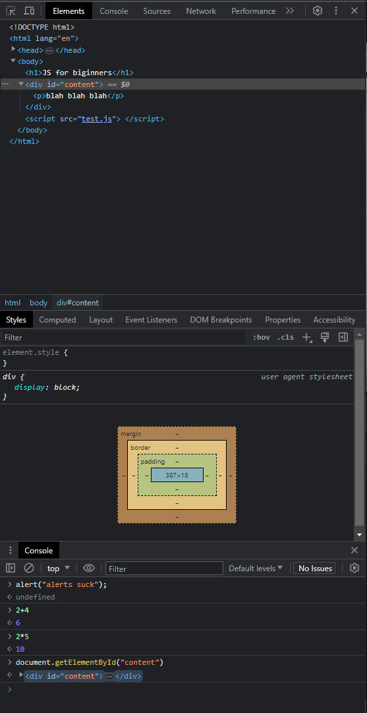

# JavaScript
---
   

## Theory
 

### Html
    Controls structure of your web page.

### CSS
    Controls presentation /design

### JS
    Adds behaviour and interactivity

### Key Points

- Methods/Functions/Behaviours:
    - Have `()` at the end
    - Parameters can be added in `()`
    - Eg: `myCar.drive()`
- Properties:
    - Bits of info about car
    - Eg: `myCar.maxspeed`

  

### USing Chrome Developer Tools
    To Open: F12

---
---

  

## Codes With Explanations
 

### Hello World

#### Code

    <!-- <!DOCTYPE html> -->
    
    <html>
        
        <head>
            <title>
                Hello, World!
            </title>
        </head>
        
        <body>
            
        </body>

    </html>

---
 

### Using Another File for Script

#### Code

##### index.html

    <!DOCTYPE html>

    <html lang="en">
        
        <head>
            <meta charset="utf-g" />
            <title> Hello, World! </title>
        </head>
        
        <body>

            <h1>JS for biginners</h1>
            
            

                
blah blah blah

            

            

        </body>

    </html>

##### test.js

    alert("Hello, World!");

---
 

### Logging to Console

#### Explanation

- `document.write(myVar2)` or `document.write("AB"+0+7)`
(Writes on Document/Page)

- `console.log(myVar2)`
AB (Writes to console)

---
 

### Variables

#### Code

    var myVar;
    undefined

    myVar = 10;
    10

    var myVar2;
    undefined

    myVar2 = "DK";
    'DK'

    var myVar3 = 10.5;
    undefined

    myVar3
    10.5
    

    myVar2 = "AB";
    'AB'

    myVar2
    'AB'

    myVar = "DK";
    'DK'

    myVar
    'DK'

#### Explanation

- No req for specifying data types

- Has dynamic types as it can change

---
 

### Operators

#### Code

    myVar = 10;
    10
    myVar+10;
    20
    myVar=myVar-5;
    5
    myVar=myVar*5;
    25
    myVar=myVar/25;
    1
    myVar%1
    0

    5+'hello'
    '5hello'
    "hello" + " DK"
    'hello DK'

    myVar+=9
    10

    ++myVar
    11

#### Explanation

- Most common operators:
  - `=`
  - `+`
  - `-`
  - `*`
  - `/`
  - `%`

 

- `+` can concatenate stings as well as numbers with other strings

- Short-hand method `operator=`

---
 

### Comparision Operators

#### Code

    var myVar = 5;
    undefined
    myVar<5
    false
    myVar>5
    false
    myVar<=5
    true
    myVar>=5
    true
    myVar==5
    true
    myVar!=5
    false

    myVar="5"
    '5'
    myVar==5
    true
    myVar===5
    false
    myVar!=5
    false
    myVar!==5
    true
    
#### Explanation

- `===` is used to check value and type of variable

---
 

### Logical Operators

#### Code

##### index.html

    <!DOCTYPE html>

    <html>  
        <body>
            

        </body>
    </html>

##### test.js

    var myAge = 21;

    if (myAge >=18 && myAge <= 30){
        document.write("You can come, you cool dude");
    }
    else{
        document.write("You aint comming!");
    }

#### Explanation

- There are 3 logical operators:
  - AND `&&`
  - OR `||`
  - NOT `!`

---
 

### Booleans

#### Code

    var iLikeMeat = true
    undefined
    iLikeMeat
    true

    7>10
    false
    7==7
    true

    Boolean(7<13)
    true

    Boolean(0)
    false

    Boolean("Dk")
    true
    Boolean("")
    false

#### Explanation

- `0` and `-0` are only false numbers

- Empty string returns false

---
 

### IF Else Statements

#### Code

##### test.js

    var youLikeMeat = true;
    var myNum = 10;
    var yourNum = 10;
    if (myNum>yourNum){
        document.write("myNum is Greater then yourNum");
    }
    else if(myNum<yourNum){
        document.write("myNum is Less then yourNum");
    }
    else{
        document.write("myNum is equal to yourNum");
    }

---
 

### Loops

#### While Loop Code

##### test.js
    
    var myAge = 21;
    while (myAge<25){
        document.write("Your age is less then 21");
        document.write(" ");
        myAge++;
    }
    document.write("Your are now 21");

#### For Loop Code

##### test.js

    for (i=1; i<=5; i++){
    console.log(i);
    }
    console.log("All links looped");

#### Practical Example for Loop Code

##### index.html
    <!DOCTYPE html>

    <html>  
        <body>
            <a href="Images/image.png">Link 1</a>
            <a href="Images/image.png">Link 2</a>
            <a href="Images/image.png">Link 3</a>
            <a href="Images/image.png">Link 4</a>
            <a href="Images/image.png">Link 5</a>
            <a href="Images/image.png">Link 6</a>
            
        </body>
    </html>

##### test.js

    var links = document.getElementsByTagName("a");

    for(i=0; i<links.length; i++){
    links[i].className = "Link-" + i;
    }

---
 

### Break & Continue

#### Code

##### test.js
    for (i=1; i<=10; i++){
        if(i===2 || i===4){
            continue;
        }
    if(i===6){
        break;
    }
    console.log(i);
    }
    console.log("Broken out of the loop");

#### Explanation

- `break` breaks you out of the loop completely

- `continue` just skips the specified iteration

---
 

### Functions

#### Code

##### test.js
    function getAvg (a,b) {
        var avg = (a+b)/2;
        console.log(avg);
        return avg;
    }
    var result = getAvg(7,12);
    document.write("Result is " + result);

---
 

 

### Variable Scope

#### Code

##### test.js
    function getAvg (a,b) {
        var avg = (a+b)/2; //Local Var
        console.log(avg);
        return avg;
    }
    var result = getAvg(7,12); //Global Var
    document.write("Result is " + result);

#### Explanation

- Global: Can be used anywhere in the code

- Local: Can be used only in the specific block code

---
 

### Numbers

#### Code

##### test.js
    var a = 5;
    var b = 5;
    console.log(a+b);
Output: 
- 7

 

    var a = "5";
    var b = 5;
    console.log(a+b);
    console.log(typeof(a+b));

Outputs:
- 55
- string

 

    //Math Objects
    console.log(Math.round(7.5));
    console.log(Math.floor(7.5));
    console.log(Math.ceil(7.5));
    console.log(Math.max(7,5,9,6,4));
    console.log(Math.min(7,5,9,6,4));
    console.log(Math.PI);

Outputs:
- 8
- 7
- 8
- 9
- 4
- 3.141592653589793

 

#### Explanation

- Black color represents Strings

- Blue color represents Numbers

---
 

### NaN

#### Code

##### test.js
    var a = "5";
    var b = 5;
    console.log(a*b);

Output:
- 25

 

    var a = 5;
    var b = "apples";
    console.log(a*b);

Output:
- NaN

 

    var a = "apples";
    var b = 5;

    if(isNaN(a)){
        console.log("That ain't a no");
    }
    else{
        console.log(a*b + " is a no");
    }

Output:
- That ain't a no

 

    var a = "apples";
    var b = 5;

    if(isNaN(a)){
        console.log("That ain't a no");
    }
    else{
        console.log(a*b + " is a no");
    }

Output:
- 25 is a no

---
 

### Strings

#### Code

##### test.js
    var str1 = "I am x 'function-1' string";
    console.log(str1);
    var str2 = 'I am "function-2" string';
    console.log(str2);
    var str3 = "I\'m 'function-3' string";
    console.log(str3);
    
    //Properties of Strings
    console.log(str1.length);

    //Functions of String
    console.log(str1.toUpperCase(str1));
    console.log(str1.indexOf("string"));

    if(str1.indexOf("x") === -1){
        console.log("The letter 'x' is not in the string");
    }
    else{
        console.log("The letter 'x' starts at position " + str1.indexOf("x"));
    }

Output:
- I am x 'function-1' string
- I am "function-2" string
- I'm 'function-3' string
  
- 26
  
- I AM X 'FUNCTION-1' STRING
- 20
  
- The letter 'x' starts at position 5

 

    //Comparing Strings
    var str4 = "abc";
    var str5 = "ABC";
    console.log(str4===str5);
    console.log(str4.toLowerCase===str5.toLowerCase);

    console.log(str4<str5);
    console.log(str4>str5);

    var str6 = "abc";
    var str7 = "bcd";
    console.log(str6<str7);
    console.log(str6>str7);

Output:
- false
- true
  
- false
- true
  
- true
- false

#### Explanation

- Lower case letters are greater in JS

- Upper case letters are smaller in JS

---
 

### Slice an Split Methods of Strings

#### Code
   
    //Slice
    var str1 = "hello, world"
    undefined
    str1
    'hello, world'

    var str2 = str1.slice(0,5)
    undefined
    str2
    'hello'

    var str3 = str.slice(7)
    undefined
    str3
    'world'
    
 

    //Split
    var tags = "meat, beef, chicken";
    undefined
    tags
    'meat, beef, chicken'
    var tagsArray = tags.split(",");
    undefined
    tagsArray
    (3) ['meat', ' beef', ' chicken']

---
 

### Arrays 

#### Code

    //Declaring and initializing arrays

    //Way_1

    var myArray_1 = [];
    undefined

    myArray_1[0] = 0;
    0

    myArray_1[1]= "zero";
    'zero'

    myArray_1[2]= false;
    false

    myArray_1
    (3) [0, 'zero', false]    

    console.log(myArray_1);
    (3) [0, 'zero', false]

    myArray_1[2]=true;
    true

    myArray_1
    (3) [0, 'zero', true]

    //Way_2
    
    var myArray_2 = [1, "one", true];
    undefined

    myArray_2
    (3) [1, 'one', true]

    //Way_3
    
    var myArray_3 = new Array(5);

    //Mthods that we use in Arrays
    
    myArray_2.length
    3

    myArray_2.sort();
    (3) [1, 'one', true]

    myArray_2.reverse();
    (3) [true, 'one', 1]

#### Explanation

- JS is `0` based language so array starts with `0` 

- Can store different datatypes in an array

- Array can be updated

- Using 3rd method we can specify no of slots of the array

---
 

### Creating Objects

#### Code

    //Way-1

    var myString_1 = new String();
    undefined

    myString_1 = "hello";
    'hello'

    myString_1.length;
    5

    myString_1.toUpperCase();
    'HELLO'

    //Way-2 (Short)

    var myString_2 = "hi there";
    undefined

    myString_2.length;
    8

##### test.js

    Creating a new Object
    //Way-1

    var myCar_1 = new Object();
    myCar_1.maxSpeed=180;
    myCar_1.driver="AB";

    console.log(myCar_1.maxSpeed);
    console.log(myCar_1.driver);

    myCar_1.drive = function(){console.log("Now Driving");};
    myCar_1.drive();

    //Way-2 (Short)

    var myCar_2 = {
        maxSpeed: 200,
        driver: "DK",
        drive: function(speed, time) {
            console.log(speed*time);
        }
    };

    console.log(myCar_2.maxSpeed);
    console.log(myCar_2.driver);
    myCar_2.drive(180, 3);

Output:

- 180
- AB
- Now Driving
  
- 200
- DK
- 540

---
 

### 

#### Code

##### index.html

##### test.js
    

---
 

### 

#### Code

##### index.html

##### test.js
    

---
 

### 

#### Code

##### index.html

##### test.js
    

---
 

### 

#### Code

##### index.html

##### test.js
    

---
 

